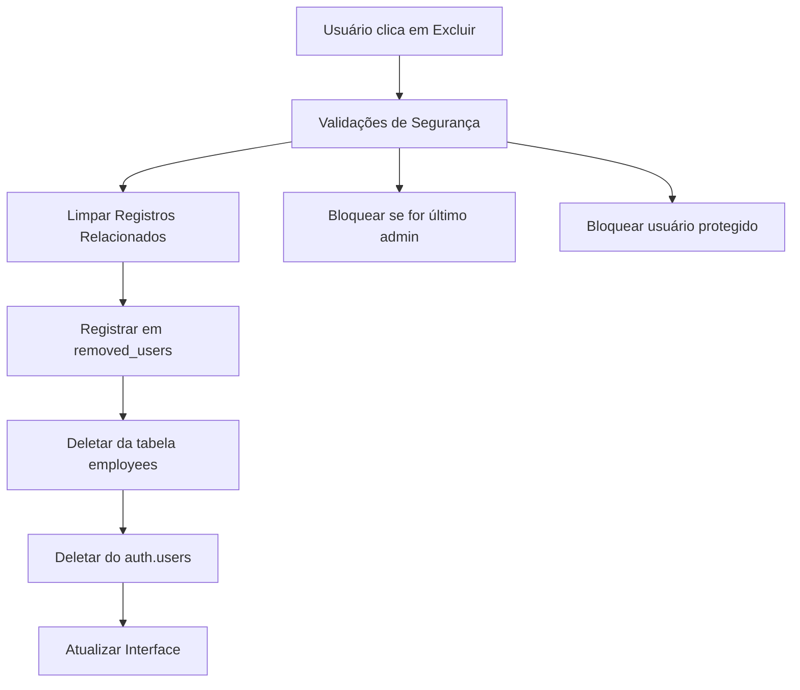

# 🗑️ Guia de Exclusão Completa de Usuários

## Visão Geral

Para deletar um usuário **permanentemente** do sistema, é necessário remover os dados de **duas localizações**:

1. **Tabela `employees`** (dados da aplicação)
2. **Tabela `auth.users`** (sistema de autenticação do Supabase)

## ⚠️ Configuração Necessária

### 1. Variável de Ambiente Obrigatória

Adicione no seu arquivo `.env`:

```bash
# Configuração existente
VITE_SUPABASE_URL=your_supabase_url
VITE_SUPABASE_ANON_KEY=your_anon_key

# NOVA VARIÁVEL NECESSÁRIA PARA EXCLUSÃO COMPLETA
VITE_SUPABASE_SERVICE_ROLE_KEY=your_service_role_key
```

### 2. Onde Encontrar a SERVICE_ROLE_KEY

1. Acesse o **Dashboard do Supabase**
2. Vá em **Settings** → **API**
3. Copie a **service_role secret** (não a pública!)

⚠️ **IMPORTANTE**: A SERVICE_ROLE_KEY tem privilégios administrativos totais. Mantenha-a segura!

## 🔄 Fluxo de Exclusão Completa

### Processo Automático (Implementado)



### Validações de Segurança

1. **Último Admin**: Impede exclusão do último administrador
2. **Usuário Protegido**: Bloqueia exclusão de `profitestrategista@gmail.com`
3. **Registros Relacionados**: Limpa todas as referências antes da exclusão

### Limpeza de Registros

O sistema automaticamente limpa referências em:
- ✅ `service_notes` (employee_id → null)
- ✅ `inspections` (employee_id → null)
- ✅ `contracts` (salesperson_id → null)
- ✅ `fines` (employee_id/driver_id → null)
- ✅ `costs` (created_by_employee_id → null)

## 🚨 Cenários de Exclusão

### Cenário 1: Configuração Completa ✅
```
SERVICE_ROLE_KEY configurada
↓
Exclusão completa de ambas as tabelas
↓
Usuário não consegue mais fazer login
```

### Cenário 2: Configuração Incompleta ⚠️
```
SERVICE_ROLE_KEY não configurada
↓
Exclusão apenas da tabela employees
↓
Usuário ainda pode tentar fazer login (mas será bloqueado)
```

## 🛠️ Comandos para Exclusão Manual

### Via Interface Admin
1. Acesse **Admin Panel**
2. Localize o usuário na lista
3. Clique no ícone de lixeira
4. Confirme a exclusão

### Via SQL (Emergência)
```sql
-- APENAS EM EMERGÊNCIA - Execute na ordem:

-- 1. Limpar registros relacionados
UPDATE service_notes SET employee_id = NULL WHERE employee_id = 'user_id_here';
UPDATE inspections SET employee_id = NULL WHERE employee_id = 'user_id_here';
UPDATE contracts SET salesperson_id = NULL WHERE salesperson_id = 'user_id_here';
UPDATE fines SET employee_id = NULL, driver_id = NULL WHERE employee_id = 'user_id_here' OR driver_id = 'user_id_here';
UPDATE costs SET created_by_employee_id = NULL WHERE created_by_employee_id = 'user_id_here';

-- 2. Registrar remoção
INSERT INTO removed_users (id, email, removed_at) 
VALUES ('user_id_here', 'user@email.com', NOW());

-- 3. Deletar da aplicação
DELETE FROM employees WHERE id = 'user_id_here';

-- 4. Deletar do auth (requer SERVICE_ROLE_KEY via Admin API)
```

## 📋 Checklist de Exclusão

Antes de excluir um usuário, verifique:

- [ ] Não é o último administrador do sistema
- [ ] Não é um usuário protegido
- [ ] SERVICE_ROLE_KEY está configurada (para exclusão completa)
- [ ] Backup dos dados foi realizado (se necessário)
- [ ] Usuário não possui sessões ativas críticas

## 🔧 Troubleshooting

### Erro: "Usuário removido da aplicação, mas pode ainda conseguir fazer login"
**Causa**: SERVICE_ROLE_KEY não configurada ou inválida
**Solução**: Configurar corretamente a variável de ambiente

### Erro: "Não é possível excluir o último administrador"
**Causa**: Tentativa de excluir o último admin
**Solução**: Criar outro admin antes da exclusão

### Erro: "Este usuário não pode ser excluído"
**Causa**: Usuário protegido (profitestrategista@gmail.com)
**Solução**: Este usuário não pode ser excluído por segurança

## 🔒 Segurança

### Logs de Exclusão
- Todas as exclusões são logadas no console
- Usuários excluídos são registrados em `removed_users`
- Emails dos usuários excluídos ficam bloqueados para novo cadastro

### Reversão
- **Exclusão de `employees`**: Pode ser revertida se o backup existir
- **Exclusão de `auth.users`**: **IRREVERSÍVEL** - o usuário perde acesso permanentemente

## 📞 Suporte

Em caso de problemas:
1. Verifique os logs do console do navegador
2. Confirme as variáveis de ambiente
3. Teste com um usuário não-crítico primeiro
4. Contate o administrador do sistema se necessário 